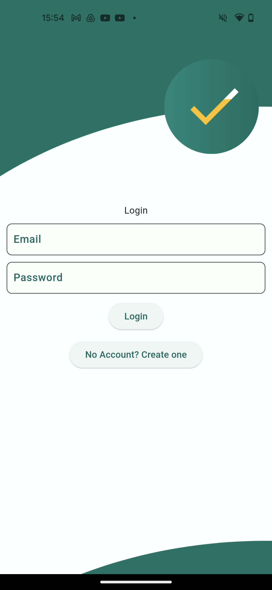
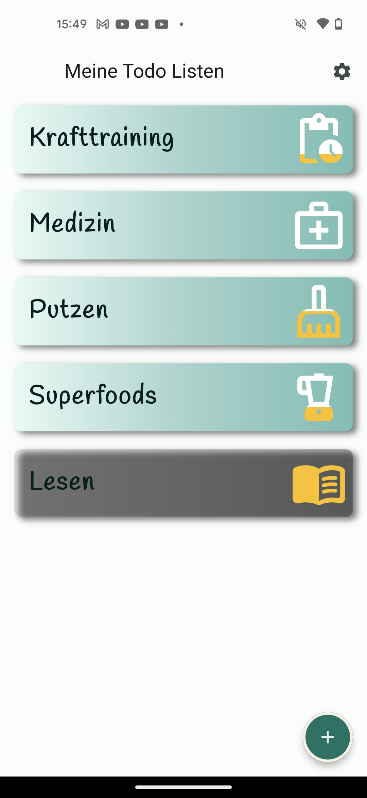
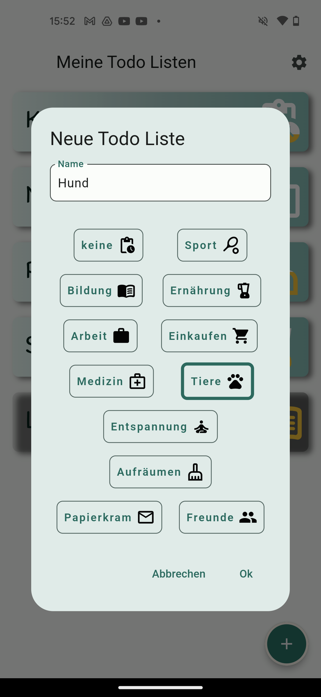
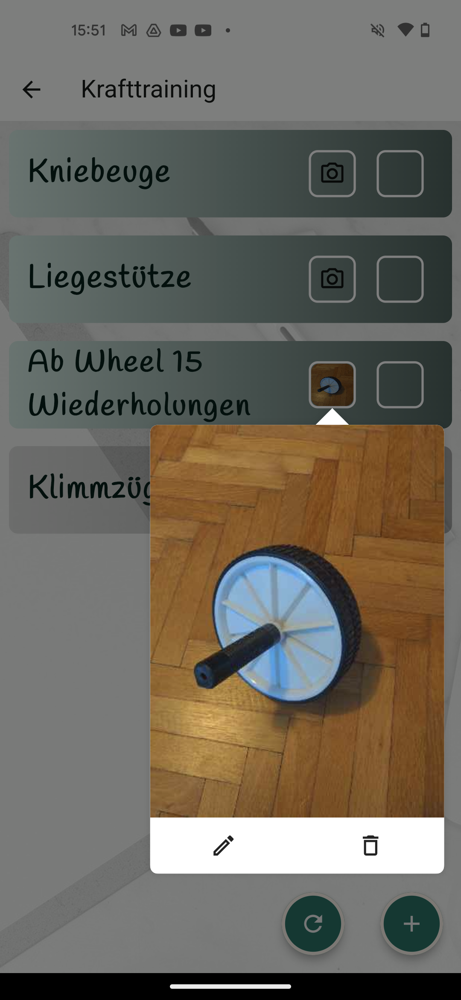
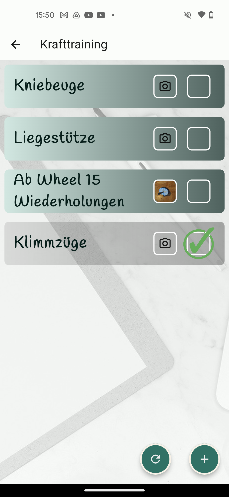

# Hakendran

This is yet another Todo List app which was fully written by me, Baris Kosebas. I have created it to use it in real life
and to practice every part of a fullstack project.  

All pictures used in this project are CC0 assets taken from pixabay.de. 
Feel free to contact me on bariskoe@gmail.com if you are looking for a developer with 2 years of work experience in Flutter.

Download the APK of this App at 
https://drive.google.com/file/d/1RsX77dXHK3MD7u5V2JxpR5BDNG3e3dNV/view?usp=drive_link

  &nbsp;&nbsp;  &nbsp;&nbsp;   &nbsp;&nbsp;   &nbsp;&nbsp;     &nbsp;&nbsp;   