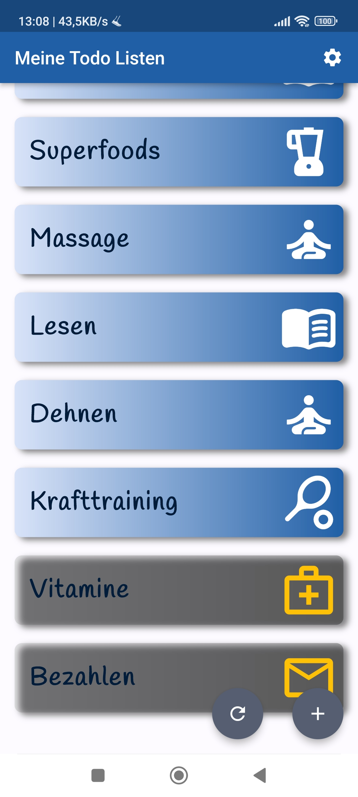
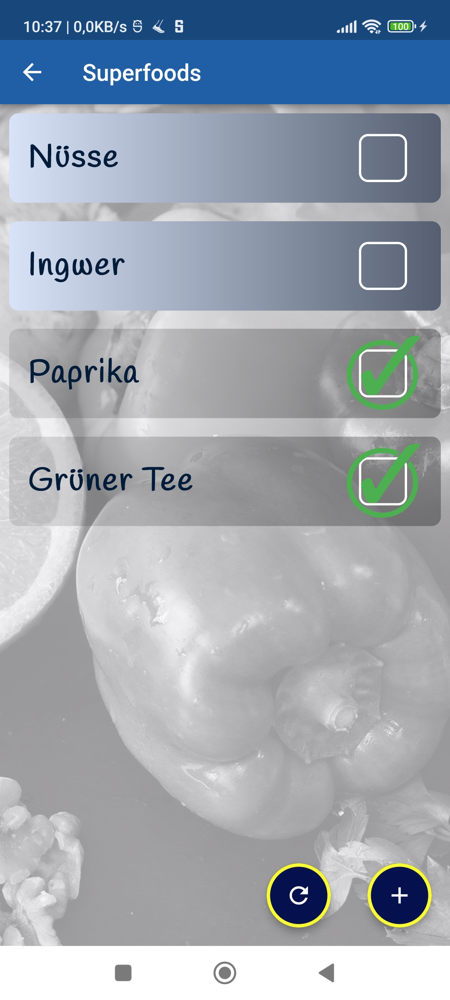
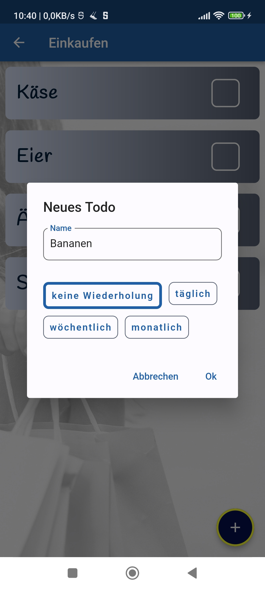

# baristodolistapp

This is yet another Todo List app which was fully written by me, Baris Kosebas. I have created it because I really want
to use it in real life and to apply the newest version of the Bloc state management.
In order to apply the Intl package and to set the base for a possible publication in the Appstore or Playstore, I 
integrated localization for English, German and Turkish.  

All pictures used in this project are CC0 assets taken from pixabay.de. 
Feel free to contact me on bariskoe@gmail.com if you are looking for a developer with 2 years of work experience in Flutter.

Download the APK of this App at

https://drive.google.com/file/d/14-xDxaSc2NCfZDbHvV3D3t79vAYl9uFD/view?usp=sharing

     