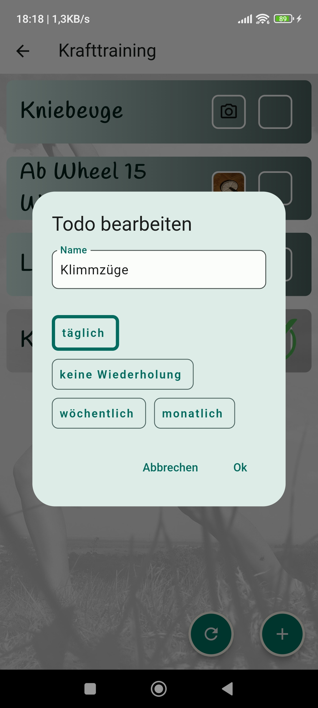

# Hakendran

This is yet another Todo List app which was fully written by me, Baris Kosebas. I have created it to use it in real life
and to practice every part of a fullstack project.  
The app communicates with a Node.js backend which runs on Google Cloud Functions. All data gets saved locally and in the cloud and synchronized 
with Firebase Firestore and Firebase Storage.
Both, the mobile app and the backend were completely created by myself. 

All pictures used in this project are CC0 assets taken from pixabay.de. 
Feel free to contact me on bariskoe@gmail.com if you are looking for a developer with 5 years of experience in Flutter.

Download the APK of this App: 
https://drive.google.com/file/d/1QwZQbEVtLTSUnU1M0tFLLnhSsJz5lkq1/view?usp=sharing

  &nbsp;&nbsp;  &nbsp;&nbsp;   &nbsp;&nbsp;   &nbsp;&nbsp;     &nbsp;&nbsp;      &nbsp;&nbsp;   